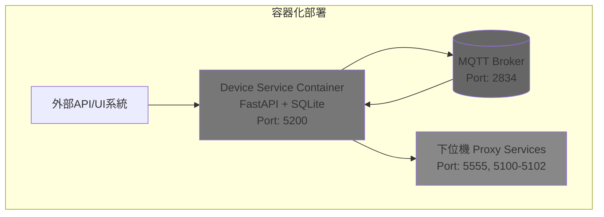

# Device Service 微服務架構設計

## 概述

Device Service 是 MCS 系統中的設備服務管理微服務，負責管理下位機代理服務的配置、狀態監控和控制功能。該服務基於 SQLite 資料庫進行資料持久化，提供 RESTful API 進行設備服務管理，並透過 MQTT 協議與其他系統進行通訊。

## 架構設計

### 1. 服務架構圖

```mermaid
graph TB
    subgraph "API層"
        WEB_API[Web API<br/>/health, /DeviceServiceConfig/*<br/>/Start/*, /Stop/*, /Pause/*<br/>/Resume/*, /ProxyStatus/*]
        HEALTH_API[健康檢查API<br/>/health]
    end

    subgraph "業務邏輯層"
        DEVICE_MGR[DeviceServiceManager<br/>核心管理邏輯]
        DEVICE_PROC[DeviceServiceProcessor<br/>設備服務處理]
        BG_WORKER[BackgroundWorker<br/>背景工作程序]
    end

    subgraph "資料存取層"
        DEVICE_REPO[DeviceRepository<br/>設備資料存取]
    end

    subgraph "MQTT通信層"
        MQTT_CLIENT[MQTT客戶端<br/>連接管理]
        MSG_HANDLER[MqttMessageHandler<br/>訊息處理器]
        EVENT_PUB[MqttEventPublisher<br/>事件發佈器]
    end

    subgraph "資料庫層"
        SQLITE_DB[(SQLite Database<br/>DeviceServiceTbl)]
    end

    WEB_API --> DEVICE_MGR
    HEALTH_API --> DEVICE_MGR

    DEVICE_MGR --> DEVICE_PROC
    DEVICE_MGR --> BG_WORKER

    DEVICE_PROC --> DEVICE_REPO
    BG_WORKER --> MSG_HANDLER

    DEVICE_REPO --> SQLITE_DB

    MSG_HANDLER --> MQTT_CLIENT
    EVENT_PUB --> MQTT_CLIENT

    style DEVICE_MGR fill:#000000
    style SQLITE_DB fill:#000000
    style MQTT_CLIENT fill:#000000
```



### 2. 資料庫設計

#### 設備服務配置表 (DeviceServiceTbl)
```sql
CREATE TABLE DeviceServiceTbl (
    proxyid INTEGER PRIMARY KEY,
    ip TEXT NOT NULL,
    port INTEGER NOT NULL,
    Controller_type TEXT NOT NULL,
    Controller_ip TEXT NOT NULL,
    Controller_port INTEGER NOT NULL,
    remark TEXT,
    enable INTEGER NOT NULL DEFAULT 0,
    createUser TEXT NOT NULL,
    createDate TIMESTAMP DEFAULT CURRENT_TIMESTAMP,
    ModiftyDate TIMESTAMP DEFAULT CURRENT_TIMESTAMP
);

-- 索引
CREATE INDEX idx_proxyid ON DeviceServiceTbl(proxyid);
CREATE INDEX idx_enable ON DeviceServiceTbl(enable);
CREATE INDEX idx_Controller_type ON DeviceServiceTbl(Controller_type);
CREATE INDEX idx_createDate ON DeviceServiceTbl(createDate);
```

### 3. API 設計

#### 健康檢查 API
- `GET /health` - 服務健康狀態
  - 回應格式: `{"message":"Device Service is running","version":"1.0.0"}`

#### 設備服務配置 API (CRUD)
- `GET /DeviceServiceConfig` - 獲取所有設備服務配置
- `GET /DeviceServiceConfig/{proxyid}` - 獲取特定設備服務配置
- `POST /DeviceServiceConfig` - 建立新設備服務配置
- `PUT /DeviceServiceConfig/{proxyid}` - 更新設備服務配置
- `DELETE /DeviceServiceConfig/{proxyid}` - 刪除設備服務配置

#### 設備控制 API
- `POST /Start/{proxyid}` - 啟動指定代理服務
- `POST /Stop/{proxyid}` - 停止指定代理服務
- `POST /Pause/{proxyid}` - 暫停指定代理服務
- `POST /Resume/{proxyid}` - 恢復指定代理服務

#### 狀態查詢 API
- `GET /ProxyStatus` - 獲取所有代理服務狀態
- `GET /ProxyStatus/{proxyid}` - 獲取指定代理服務狀態

### 4. MQTT 訊息設計

#### 發佈主題
- `mcs/events/deviveService/start` - 告知 Device Service 啟動
- `mcs/events/ProxyService/status/` - 更新Proxy Service 目前狀態

#### 訂閱主題
- `mcs/events/ProxyService/status/+` - 訂閱所有代理服務狀態更新

#### 訊息格式
```json
{
  "message": "OK",
  "proxyid": 2,
  "status": "disable"
}
```

### 5. 組件說明

#### DeviceServiceManager
核心管理類，負責協調各個組件：
- 初始化服務
- 管理設備服務處理流程
- 處理健康檢查
- 協調 API 請求處理

#### DeviceServiceProcessor
處理設備服務業務邏輯：
- 驗證設備服務資料
- 儲存和更新設備服務配置
- 處理設備控制命令（啟動、停止、暫停、恢復）
- 查詢設備服務狀態

#### BackgroundWorker
負責背景處理任務：
- 定時讀取資料庫內容並快取到記憶體
- 定時呼叫下位機 Health API
- 根據回應狀態控制設備服務
- 透過 MQTT 發佈狀態更新

#### DeviceRepository
資料存取介面：
- 設備服務配置的 CRUD 操作
- 設備服務狀態查詢
- 資料庫連接管理

#### MQTT 組件
通信處理：
- MqttClient：MQTT 連接管理
- MqttMessageHandler：訊息接收處理
- MqttEventPublisher：事件發佈

## 部署架構



## 技術棧

- **框架**: FastAPI (異步Web框架)
- **資料庫**: SQLite (輕量級資料庫)
- **MQTT**: paho-mqtt (MQTT客戶端)
- **ORM**: SQLAlchemy (資料庫操作)
- **配置**: Pydantic Settings (環境變數管理)
- **日誌**: Python logging
- **容器化**: Docker

## 目錄結構

```
DeviceService/
├── app/
│   ├── __init__.py
│   ├── main.py                 # 應用程式入口
│   ├── config.py               # 配置管理
│   ├── database.py             # 資料庫連接
│   ├── models/                 # 資料模型
│   │   ├── __init__.py
│   │   └── device.py          # 設備服務模型
│   ├── repositories/           # 資料存取層
│   │   ├── __init__.py
│   │   └── device_repository.py
│   ├── services/               # 業務邏輯層
│   │   ├── __init__.py
│   │   ├── device_manager.py
│   │   ├── device_processor.py
│   │   └── background_worker.py
│   ├── mqtt/                   # MQTT通信層
│   │   ├── __init__.py
│   │   ├── client.py
│   │   ├── handler.py
│   │   └── publisher.py
│   └── api/                    # API層
│       ├── __init__.py
│       └── routes/
│           ├── __init__.py
│           ├── health.py
│           └── devices.py
├── tests/                      # 測試
│   ├── __init__.py
│   ├── test_device_service.py
│   └── test_mqtt_integration.py
├── Dockerfile                  # 容器化配置
├── requirements.txt            # 依賴包
├── .env.example               # 環境變數範例
└── README.md                  # 本文件
```

## 環境變數

```bash
# 服務配置
DEVICE_SERVICE_HOST=0.0.0.0
DEVICE_SERVICE_PORT=5200

# 資料庫配置
DATABASE_URL=sqlite:///./device_service.db

# MQTT配置
MQTT_BROKER_HOST=127.0.0.1
MQTT_BROKER_PORT=2834
MQTT_CLIENT_ID=device_service

# 背景工作程序配置
BACKGROUND_WORKER_INTERVAL=1

# Web API 多工作者設定
UVICORN_WORKERS=1

# 背景工作程序控制
RUN_BACKGROUND_WORKER=false

# 日誌配置
LOG_LEVEL=INFO
LOG_FILE=device_service.log
```

## 範例資料和 API 使用範例

### 範例資料
```sql
INSERT INTO DeviceServiceTbl (proxyid, proxy_ip, proxy_port, Controller_type, Controller_ip, Controller_port, remark, enable, createUser) VALUES
(1, '127.0.0.1', 5555, 'E82', '127.0.0.1', 5100, 'tsc1', 0, 'Wepapi'),
(2, '127.0.0.1', 5555, 'E88', '127.0.0.1', 5101, 'stk1', 0, 'Wepapi'),
(3, '127.0.0.1', 5555, 'E88', '127.0.0.1', 5102, 'stk2', 0, 'Wepapi');
```

### Curl 命令範例

#### 建立設備服務配置
```bash
curl -X POST "http://localhost:5200/DeviceServiceConfig" \
  -H "Content-Type: application/json" \
  -d '{
    "proxyid": 1,
    "proxy_ip": "127.0.0.1",
    "proxy_port": 5555,
    "Controller_type": "E82",
    "Controller_ip": "127.0.0.1",
    "Controller_port": 5100,
    "remark": "tsc1",
    "enable": 1,
    "createUser": "Wepapi"
  }'

curl -X POST "http://localhost:5200/DeviceServiceConfig" \
  -H "Content-Type: application/json" \
  -d '{
    "proxyid": 2,
    "proxy_ip": "127.0.0.1",
    "proxy_port": 5555,
    "Controller_type": "E88",
    "Controller_ip": "127.0.0.1",
    "Controller_port": 5101,
    "remark": "stk1",
    "enable": 0,
    "createUser": "Wepapi"
  }'

curl -X POST "http://localhost:5200/DeviceServiceConfig" \
  -H "Content-Type: application/json" \
  -d '{
    "proxyid": 3,
    "proxy_ip": "127.0.0.1",
    "proxy_port": 5555,
    "Controller_type": "E88",
    "Controller_ip": "127.0.0.1",
    "Controller_port": 5102,
    "remark": "stk2",
    "enable": 0,
    "createUser": "Wepapi"
  }'
```

#### 更新設備服務配置
```bash
curl -X PUT "http://localhost:5200/DeviceServiceConfig/1" \
  -H "Content-Type: application/json" \
  -d '{
    "proxy_ip": "127.0.0.1",
    "proxy_port": 5555,
    "Controller_type": "E82",
    "Controller_ip": "127.0.0.1",
    "Controller_port": 5100,
    "remark": "tsc1_updated",
    "enable": 1
  }'

curl -X PUT "http://localhost:5200/DeviceServiceConfig/2" \
  -H "Content-Type: application/json" \
  -d '{
    "proxy_ip": "127.0.0.1",
    "proxy_port": 5556,
    "Controller_type": "E88",
    "Controller_ip": "127.0.0.1",
    "Controller_port": 5101,
    "remark": "stk1_updated",
    "enable": 1
  }'

curl -X PUT "http://localhost:5200/DeviceServiceConfig/3" \
  -H "Content-Type: application/json" \
  -d '{
    "proxy_ip": "127.0.0.1",
    "proxy_port": 5557,
    "Controller_type": "E88",
    "Controller_ip": "127.0.0.1",
    "Controller_port": 5102,
    "remark": "stk2_updated",
    "enable": 1
  }'
```

#### 刪除設備服務配置
```bash
curl -X DELETE "http://localhost:5200/DeviceServiceConfig/1"
curl -X DELETE "http://localhost:5200/DeviceServiceConfig/2"
curl -X DELETE "http://localhost:5200/DeviceServiceConfig/3"
```

#### 設備控制範例
```bash
# 啟動代理服務
curl -X POST "http://localhost:5200/Start/1"

# 停止代理服務
curl -X POST "http://localhost:5200/Stop/1"

# 暫停代理服務
curl -X POST "http://localhost:5200/Pause/1"

# 恢復代理服務
curl -X POST "http://localhost:5200/Resume/1"
```

#### 狀態查詢範例
```bash
# 查詢所有代理服務狀態
curl -X GET "http://localhost:5200/ProxyStatus"

# 查詢特定代理服務狀態
curl -X GET "http://localhost:5200/ProxyStatus/1"

# 健康檢查
curl -X GET "http://localhost:5200/health"
```

## 開發和部署

### 本地開發
```bash
cd DeviceService
python -m venv venv
source venv/bin/activate  # Windows: venv\Scripts\activate
pip install -r requirements.txt
uvicorn app.main:app --reload
```

🔧 其他常用的啟動選項：
# 基本啟動（僅本機連線）
python -m uvicorn app.main:app --host 127.0.0.1 --port 5200

# 生產環境啟動（無熱重載，更穩定）
python -m uvicorn app.main:app --host 0.0.0.0 --port 5200 --workers 1

# 指定環境變數檔案
python -m uvicorn app.main:app --host 0.0.0.0 --port 5200 --reload --env-file .env

### 多工作者設定 (Web API)

為了提高 Web API 的處理能力，您可以設定多個 Uvicorn 工作者來處理並發請求：

#### 命令列參數設定
```bash
# 啟動 4 個工作者
uvicorn app.main:app --host 0.0.0.0 --port 5200 --workers 4

# 啟動 8 個工作者（根據 CPU 核心數調整）
uvicorn app.main:app --host 0.0.0.0 --port 5200 --workers 8
```

#### 環境變數設定
```bash
# 在 .env 檔案中設定
UVICORN_WORKERS=4

# 啟動時讀取環境變數
uvicorn app.main:app --host 0.0.0.0 --port 5200 --workers ${UVICORN_WORKERS:-1}
```

#### 設定檔設定 (app/config.py)
```python
import os

class Settings:
    UVICORN_WORKERS: int = int(os.getenv("UVICORN_WORKERS", "1"))
    RUN_BACKGROUND_WORKER: bool = os.getenv("RUN_BACKGROUND_WORKER", "false").lower() == "true"
    BACKGROUND_WORKER_INTERVAL: int = int(os.getenv("BACKGROUND_WORKER_INTERVAL", "5"))

settings = Settings()
```

### 背景工作程序單一實例設定

為了避免多個背景工作程序實例同時運行（可能導致重複任務或資源衝突），建議將背景工作程序作為獨立的進程運行：

#### 獨立進程運行（推薦）
```bash
# 終端機 1：啟動 Web API（多工作者）
uvicorn app.main:app --host 0.0.0.0 --port 5200 --workers 4

# 終端機 2：啟動背景工作程序（單一實例）
python -m app.main_background_worker
```

#### 建立背景工作程序啟動腳本 (app/main_background_worker.py)
```python
import asyncio
from app.services.background_worker import BackgroundWorker
from app.database import SessionLocal

async def main():
    db = SessionLocal()
    worker = BackgroundWorker(db)
    worker.start()

    try:
        while True:
            await asyncio.sleep(3600)  # 保持運行
    except asyncio.CancelledError:
        pass
    finally:
        worker.stop()
        db.close()

if __name__ == "__main__":
    asyncio.run(main())
```

#### Docker Compose 設定範例
請參考專案根目錄下的 `docker-compose.example.yml` 文件，該文件提供了完整的多服務容器化部署範例，包括：

- **webapi**: Web API 服務（支援多工作者）
- **background_worker**: 背景工作程序服務（單一實例）
- **db**: PostgreSQL 資料庫服務
- **mqtt_broker**: MQTT Broker 服務（可選）

使用範例：
```bash
# 複製範例文件
cp docker-compose.example.yml docker-compose.yml

# 編輯環境變數設定
vim .env

# 啟動所有服務
docker-compose up -d

# 查看日誌
docker-compose logs -f webapi
docker-compose logs -f background_worker

# 停止服務
docker-compose down
```

### Docker 部署
```bash
docker build -t device-service .
docker run -p 5200:5200 --env-file .env device-service
```

### API 文檔
服務啟動後，可通過 http://localhost:5200/docs 訪問自動生成API文檔。

### MQTT Broker 設定
- **Broker**: 127.0.0.1:2834
- **用戶名**: 不需要
- **密碼**: 不需要
- **安全設定**: 無加密