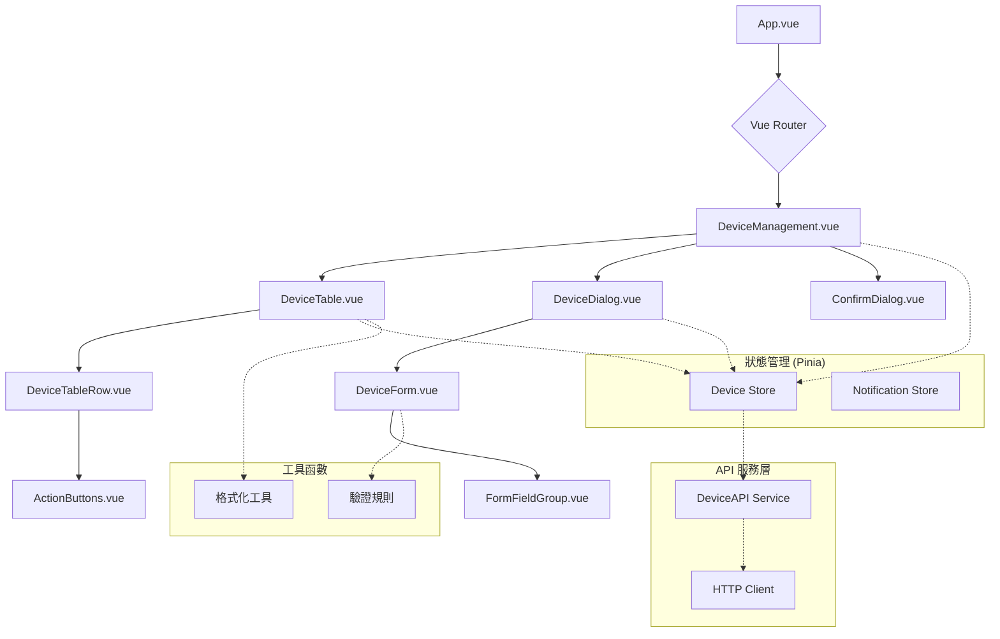
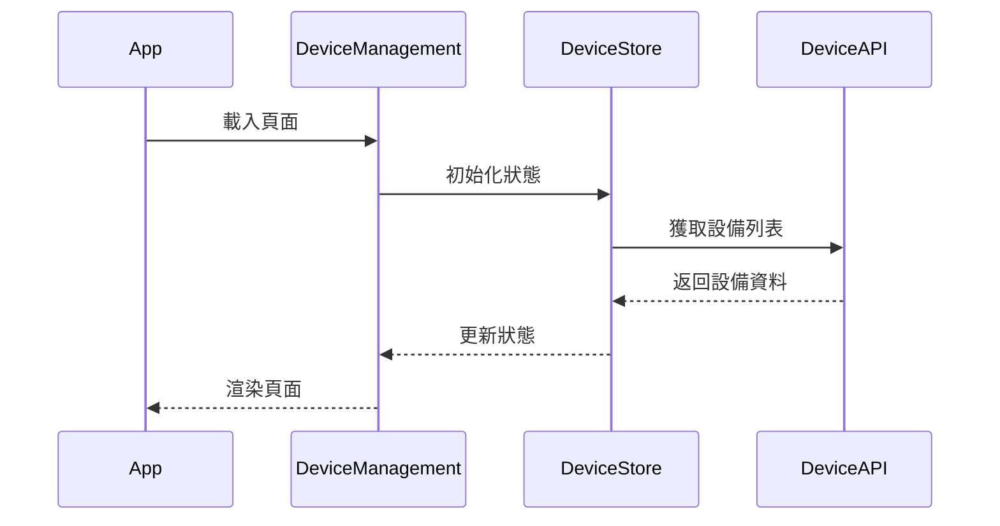
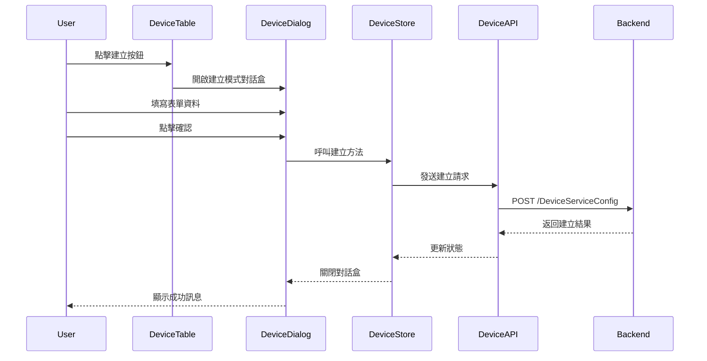
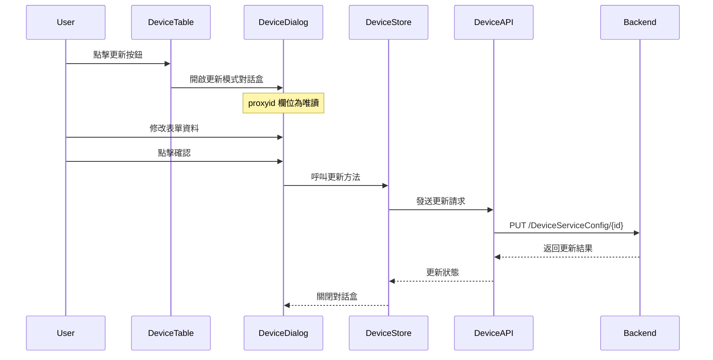
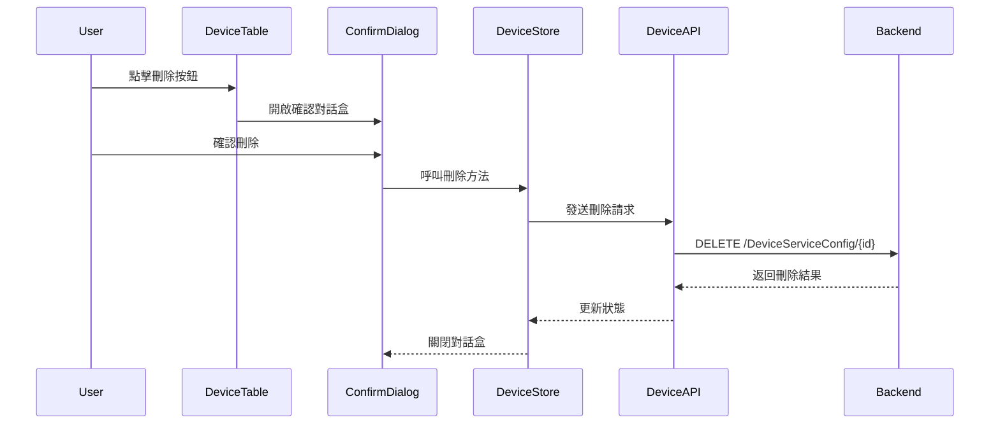
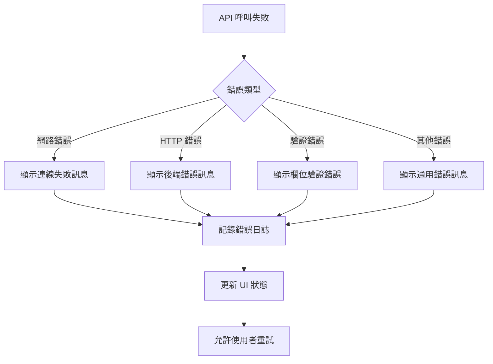

# Device Service 管理系統 - 組件架構設計

## 整體架構圖



## 組件詳細設計

### 1. 主要頁面元件

#### DeviceManagement.vue (設備管理主頁面)
**職責**: 頁面佈局與整體狀態協調

```typescript
// 組合式函數使用
const deviceStore = useDeviceStore()
const notificationStore = useNotificationStore()

// 生命週期
onMounted(async () => {
  await deviceStore.fetchDevices()
})

// 事件處理
const handleCreate = (device?: Device) => {
  deviceStore.setCurrentDevice(device || {})
  deviceStore.setDialogMode('create')
  deviceStore.setDialogVisible(true)
}

const handleUpdate = (device: Device) => {
  deviceStore.setCurrentDevice(device)
  deviceStore.setDialogMode('update')
  deviceStore.setDialogVisible(true)
}

const handleDelete = (device: Device) => {
  deviceStore.setCurrentDevice(device)
  deviceStore.setDialogMode('delete')
  deviceStore.setDialogVisible(true)
}
```

### 2. 資料展示元件

#### DeviceTable.vue (設備表格元件)
**職責**: 顯示設備列表與處理使用者互動

**屬性 (Props)**:
```typescript
interface Props {
  devices: Device[]
  loading: boolean
  onCreate: (device?: Device) => void
  onUpdate: (device: Device) => void
  onDelete: (device: Device) => void
}
```

**功能特點**:
- 使用 Element Plus 的 `el-table` 組件
- 支援排序與分頁
- 載入狀態顯示骨架屏
- 錯誤狀態處理

#### DeviceTableRow.vue (表格行元件)
**職責**: 單行資料展示與操作按鈕

```vue
<template>
  <tr>
    <td>{{ device.proxyid }}</td>
    <td>{{ device.proxy_ip }}</td>
    <td>{{ device.Controller_type }}</td>
    <!-- 其他欄位 -->
    <td>
      <ActionButtons
        :device="device"
        @create="onCreate"
        @update="onUpdate"
        @delete="onDelete"
      />
    </td>
  </tr>
</template>
```

#### ActionButtons.vue (操作按鈕元件)
**職責**: 提供 Create、Update、Delete 操作按鈕

```vue
<template>
  <div class="action-buttons">
    <el-button
      type="success"
      size="small"
      @click="$emit('create', device)"
    >
      建立
    </el-button>
    <el-button
      type="primary"
      size="small"
      @click="$emit('update', device)"
    >
      更新
    </el-button>
    <el-button
      type="danger"
      size="small"
      @click="$emit('delete', device)"
    >
      刪除
    </el-button>
  </div>
</template>
```

### 3. 對話盒元件

#### DeviceDialog.vue (設備對話盒元件)
**職責**: 統籌不同操作模式的對話盒顯示

```typescript
// 根據模式顯示不同內容
const dialogTitle = computed(() => {
  const mode = deviceStore.dialogMode
  const titles = {
    create: '建立設備',
    update: '更新設備',
    delete: '刪除設備'
  }
  return titles[mode]
})

const handleConfirm = async () => {
  try {
    await deviceStore.executeCurrentAction()
    deviceStore.setDialogVisible(false)
    notificationStore.showSuccess('操作成功')
  } catch (error) {
    notificationStore.showError(error.message)
  }
}
```

#### DeviceForm.vue (設備表單元件)
**職責**: 處理建立與更新模式的表單邏輯

**表單欄位設計**:
```vue
<template>
  <el-form
    ref="formRef"
    :model="formData"
    :rules="rules"
    label-width="120px"
  >
    <!-- proxyid 欄位 -->
    <el-form-item
      label="代理 ID"
      prop="proxyid"
      v-if="mode === 'create'"
    >
      <el-input
        v-model.number="formData.proxyid"
        placeholder="請輸入代理 ID"
      />
    </el-form-item>

    <el-form-item
      label="代理 ID"
      prop="proxyid"
      v-else
    >
      <el-input
        v-model.number="formData.proxyid"
        placeholder="請輸入代理 ID"
        disabled
      />
    </el-form-item>

    <!-- proxy_ip 欄位 -->
    <el-form-item label="代理 IP" prop="proxy_ip">
      <el-input
        v-model="formData.proxy_ip"
        placeholder="例如: 192.168.1.100"
      />
    </el-form-item>

    <!-- 其他欄位類似設計 -->
    <!-- ... -->

    <!-- Controller_type 下拉選單 -->
    <el-form-item label="控制器類型" prop="Controller_type">
      <el-select
        v-model="formData.Controller_type"
        placeholder="請選擇控制器類型"
      >
        <el-option label="E82" value="E82" />
        <el-option label="E84" value="E84" />
        <el-option label="E90" value="E90" />
      </el-select>
    </el-form-item>

    <!-- enable 狀態 -->
    <el-form-item label="啟用狀態" prop="enable">
      <el-radio-group v-model.number="formData.enable">
        <el-radio :label="1">啟用</el-radio>
        <el-radio :label="0">停用</el-radio>
      </el-radio-group>
    </el-form-item>
  </el-form>
</template>
```

#### ConfirmDialog.vue (確認對話盒元件)
**職責**: 處理刪除確認邏輯

```vue
<template>
  <el-dialog
    title="確認刪除"
    :visible="visible"
    @close="handleCancel"
  >
    <p>確定要刪除設備 {{ currentDevice?.proxyid }} 嗎？</p>
    <p class="text-red">此操作無法復原！</p>

    <template #footer>
      <el-button @click="handleCancel">取消</el-button>
      <el-button
        type="danger"
        @click="handleConfirm"
        :loading="loading"
      >
        確認刪除
      </el-button>
    </template>
  </el-dialog>
</template>
```

### 4. 共用元件

#### FormFieldGroup.vue (表單欄位群組)
**職責**: 封裝常用的表單欄位組合

```vue
<template>
  <div class="form-field-group">
    <el-form-item label="網路設定">
      <el-row :gutter="20">
        <el-col :span="12">
          <el-form-item label="代理 IP" prop="proxy_ip">
            <el-input v-model="formData.proxy_ip" />
          </el-form-item>
        </el-col>
        <el-col :span="12">
          <el-form-item label="代理埠號" prop="proxy_port">
            <el-input-number
              v-model="formData.proxy_port"
              :min="1"
              :max="65535"
            />
          </el-form-item>
        </el-col>
      </el-row>
    </el-form-item>

    <el-form-item label="控制器設定">
      <el-row :gutter="20">
        <el-col :span="12">
          <el-form-item label="控制器 IP" prop="Controller_ip">
            <el-input v-model="formData.Controller_ip" />
          </el-form-item>
        </el-col>
        <el-col :span="12">
          <el-form-item label="控制器埠號" prop="Controller_port">
            <el-input-number
              v-model="formData.Controller_port"
              :min="1"
              :max="65535"
            />
          </el-form-item>
        </el-col>
      </el-row>
    </el-form-item>
  </div>
</template>
```

## 資料流程設計

### 1. 初始化流程



### 2. CRUD 操作流程

#### 建立設備流程


#### 更新設備流程


#### 刪除設備流程


### 3. 錯誤處理流程



## 狀態管理設計

### Device Store 結構

```typescript
// stores/device.ts
export const useDeviceStore = defineStore('device', {
  state: (): DeviceState => ({
    devices: [],
    loading: false,
    currentDevice: null,
    dialogMode: 'create',
    dialogVisible: false,
    searchQuery: '',
    pagination: {
      page: 1,
      size: 20,
      total: 0
    }
  }),

  getters: {
    filteredDevices: (state) => {
      // 搜尋過濾邏輯
      return state.devices.filter(device =>
        device.proxyid.toString().includes(state.searchQuery) ||
        device.proxy_ip.includes(state.searchQuery)
      )
    },

    paginatedDevices: (state) => {
      // 分頁邏輯
      const start = (state.pagination.page - 1) * state.pagination.size
      return state.filteredDevices.slice(start, start + state.pagination.size)
    }
  },

  actions: {
    async fetchDevices() {
      this.loading = true
      try {
        const response = await deviceAPI.getAllDevices({
          page: this.pagination.page,
          size: this.pagination.size,
          search: this.searchQuery
        })
        this.devices = response.data
        this.pagination.total = response.total
      } catch (error) {
        throw error
      } finally {
        this.loading = false
      }
    },

    async createDevice(deviceData: DeviceCreate) {
      const response = await deviceAPI.createDevice(deviceData)
      this.devices.push(response)
      this.pagination.total += 1
    },

    async updateDevice(proxyid: number, deviceData: DeviceUpdate) {
      const response = await deviceAPI.updateDevice(proxyid, deviceData)
      const index = this.devices.findIndex(d => d.proxyid === proxyid)
      if (index !== -1) {
        this.devices[index] = response
      }
    },

    async deleteDevice(proxyid: number) {
      await deviceAPI.deleteDevice(proxyid)
      const index = this.devices.findIndex(d => d.proxyid === proxyid)
      if (index !== -1) {
        this.devices.splice(index, 1)
        this.pagination.total -= 1
      }
    }
  }
})
```

## API 服務層設計

### HTTP 客戶端設定

```typescript
// api/client.ts
import axios from 'axios'

export const httpClient = axios.create({
  baseURL: import.meta.env.VITE_API_BASE_URL,
  timeout: 10000,
  headers: {
    'Content-Type': 'application/json'
  }
})

// 請求攔截器
httpClient.interceptors.request.use(
  (config) => {
    // 加入認證標頭等
    return config
  },
  (error) => Promise.reject(error)
)

// 響應攔截器
httpClient.interceptors.response.use(
  (response) => response,
  (error) => {
    if (error.response?.status === 401) {
      // 處理未授權錯誤
    }
    return Promise.reject(error)
  }
)
```

### Device API 服務

```typescript
// api/device.ts
import { httpClient } from './client'
import type { Device, DeviceCreate, DeviceUpdate, DeviceResponse } from '@/types/device'

export class DeviceAPI {
  // 獲取所有設備
  async getAllDevices(params?: {
    page?: number
    size?: number
    search?: string
  }): Promise<DeviceResponse> {
    const response = await httpClient.get('/DeviceServiceConfig', { params })
    return response.data
  }

  // 獲取單個設備
  async getDevice(proxyid: number): Promise<Device> {
    const response = await httpClient.get(`/DeviceServiceConfig/${proxyid}`)
    return response.data
  }

  // 建立設備
  async createDevice(device: DeviceCreate): Promise<Device> {
    const response = await httpClient.post('/DeviceServiceConfig', device)
    return response.data
  }

  // 更新設備
  async updateDevice(proxyid: number, device: DeviceUpdate): Promise<Device> {
    const response = await httpClient.put(`/DeviceServiceConfig/${proxyid}`, device)
    return response.data
  }

  // 刪除設備
  async deleteDevice(proxyid: number): Promise<void> {
    await httpClient.delete(`/DeviceServiceConfig/${proxyid}`)
  }
}

export const deviceAPI = new DeviceAPI()
```

## 表單驗證設計

### 驗證規則設定

```typescript
// utils/validators.ts
import type { FormRules } from 'element-plus'

export const deviceFormRules: FormRules = {
  proxyid: [
    { required: true, message: '請輸入代理 ID', trigger: 'blur' },
    { type: 'number', min: 1, message: '代理 ID 必須大於 0', trigger: 'blur' }
  ],
  proxy_ip: [
    { required: true, message: '請輸入代理 IP', trigger: 'blur' },
    {
      pattern: /^(?:(?:25[0-5]|2[0-4][0-9]|[01]?[0-9][0-9]?)\.){3}(?:25[0-5]|2[0-4][0-9]|[01]?[0-9][0-9]?)$/,
      message: '請輸入有效的 IP 位址',
      trigger: 'blur'
    }
  ],
  proxy_port: [
    { required: true, message: '請輸入代理埠號', trigger: 'blur' },
    { type: 'number', min: 1, max: 65535, message: '埠號必須在 1-65535 之間', trigger: 'blur' }
  ],
  Controller_type: [
    { required: true, message: '請選擇控制器類型', trigger: 'change' }
  ],
  Controller_ip: [
    { required: true, message: '請輸入控制器 IP', trigger: 'blur' },
    {
      pattern: /^(?:(?:25[0-5]|2[0-4][0-9]|[01]?[0-9][0-9]?)\.){3}(?:25[0-5]|2[0-4][0-9]|[01]?[0-9][0-9]?)$/,
      message: '請輸入有效的 IP 位址',
      trigger: 'blur'
    }
  ],
  Controller_port: [
    { required: true, message: '請輸入控制器埠號', trigger: 'blur' },
    { type: 'number', min: 1, max: 65535, message: '埠號必須在 1-65535 之間', trigger: 'blur' }
  ],
  enable: [
    { required: true, message: '請選擇啟用狀態', trigger: 'change' }
  ]
}
```

## 錯誤處理設計

### 全域錯誤處理器

```typescript
// composables/useErrorHandler.ts
export const useErrorHandler = () => {
  const handleError = (error: any) => {
    if (error.response) {
      // 伺服器錯誤響應
      const { status, data } = error.response

      switch (status) {
        case 400:
          return data.message || '請求參數錯誤'
        case 404:
          return '找不到請求的資源'
        case 500:
          return '伺服器內部錯誤'
        default:
          return data.message || '未知錯誤'
      }
    } else if (error.request) {
      // 網路錯誤
      return '網路連線失敗，請檢查網路設定'
    } else {
      // 其他錯誤
      return error.message || '發生未知錯誤'
    }
  }

  return { handleError }
}
```

### 通知系統設計

```typescript
// composables/useNotification.ts
export const useNotification = () => {
  const showSuccess = (message: string) => {
    ElMessage({
      message,
      type: 'success',
      duration: 3000
    })
  }

  const showError = (message: string) => {
    ElMessage({
      message,
      type: 'error',
      duration: 5000
    })
  }

  const showWarning = (message: string) => {
    ElMessage({
      message,
      type: 'warning',
      duration: 4000
    })
  }

  return {
    showSuccess,
    showError,
    showWarning
  }
}
```

這個組件架構設計提供了清晰的職責分離、良好的資料流程和完善的錯誤處理機制，為後續的實作提供了堅實的基礎。