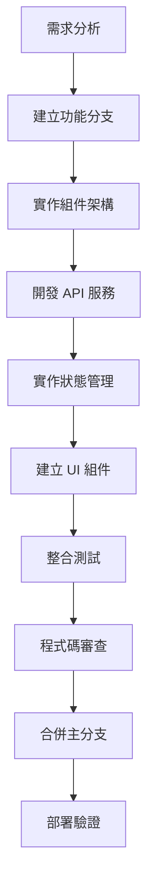

# 開發環境設定規範

## 專案初始化

### 1. 技術棧選擇

#### 核心技術
- **Vue 3**: 使用 Composition API 進行現代化開發
- **Vite**: 快速的建置工具，提供優秀的開發體驗
- **TypeScript**: 提供類型檢查，提高程式碼品質
- **Element Plus**: 成熟的 Vue 3 UI 元件庫

#### 開發工具
- **ESLint**: 程式碼品質檢查
- **Prettier**: 程式碼格式化
- **Stylelint**: CSS/SCSS 程式碼檢查
- **Husky**: Git hooks 管理
- **Commitlint**: 提交訊息規範檢查

### 2. package.json 設定

```json
{
  "name": "device-service-management",
  "version": "1.0.0",
  "description": "Device Service 管理系統前端應用",
  "type": "module",
  "scripts": {
    "dev": "vite",
    "build": "vite build",
    "preview": "vite preview",
    "type-check": "vue-tsc --noEmit",
    "lint": "eslint src --ext .vue,.ts,.tsx,.js,.jsx --fix",
    "lint:style": "stylelint src/**/*.{css,scss,vue} --fix",
    "test": "vitest",
    "test:ui": "vitest --ui",
    "test:coverage": "vitest --coverage",
    "prepare": "husky install"
  },
  "dependencies": {
    "vue": "^3.4.0",
    "vue-router": "^4.2.5",
    "pinia": "^2.1.7",
    "axios": "^1.6.0",
    "@element-plus/icons-vue": "^2.3.1",
    "element-plus": "^2.4.4",
    "path": "^0.12.7",
    "@vee-validate/rules": "^4.12.2",
    "vee-validate": "^4.12.2",
    "@types/node": "^20.10.5"
  },
  "devDependencies": {
    "@vitejs/plugin-vue": "^4.5.2",
    "vite": "^5.0.8",
    "typescript": "^5.3.3",
    "vue-tsc": "^1.8.25",
    "@types/node": "^20.10.5",
    "@typescript-eslint/eslint-plugin": "^6.14.0",
    "@typescript-eslint/parser": "^6.14.0",
    "eslint": "^8.55.0",
    "eslint-plugin-vue": "^9.19.2",
    "prettier": "^3.1.1",
    "stylelint": "^16.1.0",
    "stylelint-config-standard": "^35.0.0",
    "husky": "^8.0.3",
    "lint-staged": "^15.2.0",
    "@commitlint/cli": "^18.4.3",
    "@commitlint/config-conventional": "^18.4.3",
    "vitest": "^1.0.4",
    "@vitest/ui": "^1.0.4",
    "@vitest/coverage-v8": "^1.0.4",
    "@vue/test-utils": "^2.4.3",
    "jsdom": "^23.0.1"
  }
}
```

### 3. 環境變數設定

#### .env.development
```env
# API 設定
VITE_API_BASE_URL=http://localhost:8000
VITE_API_TIMEOUT=10000

# 應用程式設定
VITE_APP_TITLE=Device Service Management
VITE_APP_VERSION=1.0.0
VITE_APP_DESCRIPTION=設備服務管理系統

# 功能開關
VITE_ENABLE_PWA=false
VITE_ENABLE_ANALYTICS=false
VITE_ENABLE_SENTRY=false

# 開發設定
VITE_ENABLE_DEVTOOLS=true
VITE_ENABLE_MOCK=false
```

#### .env.production
```env
# API 設定
VITE_API_BASE_URL=https://api.your-domain.com
VITE_API_TIMEOUT=15000

# 應用程式設定
VITE_APP_TITLE=Device Service Management
VITE_APP_VERSION=1.0.0
VITE_APP_DESCRIPTION=設備服務管理系統

# 功能開關
VITE_ENABLE_PWA=true
VITE_ENABLE_ANALYTICS=true
VITE_ENABLE_SENTRY=true

# 開發設定
VITE_ENABLE_DEVTOOLS=false
VITE_ENABLE_MOCK=false
```

### 4. Vite 設定

#### vite.config.ts
```typescript
import { defineConfig } from 'vite'
import vue from '@vitejs/plugin-vue'
import { resolve } from 'path'

export default defineConfig({
  plugins: [vue()],

  resolve: {
    alias: {
      '@': resolve(__dirname, 'src')
    }
  },

  server: {
    port: 3000,
    proxy: {
      '/api': {
        target: 'http://localhost:8000',
        changeOrigin: true,
        secure: false
      }
    }
  },

  build: {
    target: 'esnext',
    outDir: 'dist',
    assetsDir: 'assets',
    sourcemap: false,
    minify: 'esbuild',
    rollupOptions: {
      output: {
        chunkFileNames: 'js/[name]-[hash].js',
        entryFileNames: 'js/[name]-[hash].js',
        assetFileNames: '[ext]/[name]-[hash].[ext]'
      }
    }
  },

  define: {
    __VUE_OPTIONS_API__: false,
    __VUE_PROD_DEVTOOLS__: false,
    __VUE_PROD_HYDRATION_MISMATCH_DETAILS__: false
  },

  css: {
    preprocessorOptions: {
      scss: {
        additionalData: `@use "@/styles/variables.scss" as *;`
      }
    }
  }
})
```

### 5. TypeScript 設定

#### tsconfig.json
```json
{
  "compilerOptions": {
    "target": "ES2020",
    "useDefineForClassFields": true,
    "lib": ["ES2020", "DOM", "DOM.Iterable"],
    "module": "ESNext",
    "skipLibCheck": true,

    /* Bundler mode */
    "moduleResolution": "bundler",
    "allowImportingTsExtensions": true,
    "resolveJsonModule": true,
    "isolatedModules": true,
    "noEmit": true,
    "jsx": "preserve",

    /* Linting */
    "strict": true,
    "noUnusedLocals": true,
    "noUnusedParameters": true,
    "noFallthroughCasesInSwitch": true,

    /* Path mapping */
    "baseUrl": ".",
    "paths": {
      "@/*": ["./src/*"]
    }
  },
  "include": [
    "src/**/*.ts",
    "src/**/*.d.ts",
    "src/**/*.tsx",
    "src/**/*.vue"
  ],
  "references": [
    { "path": "./tsconfig.node.json" }
  ]
}
```

#### tsconfig.node.json
```json
{
  "compilerOptions": {
    "composite": true,
    "skipLibCheck": true,
    "module": "ESNext",
    "moduleResolution": "bundler",
    "allowSyntheticDefaultImports": true
  },
  "include": ["vite.config.ts"]
}
```

### 6. ESLint 設定

#### .eslintrc.js
```javascript
module.exports = {
  root: true,
  env: {
    browser: true,
    es2021: true,
    node: true
  },
  extends: [
    'eslint:recommended',
    '@typescript-eslint/recommended',
    'plugin:vue/vue3-essential',
    'prettier'
  ],
  overrides: [
    {
      files: ['*.vue'],
      rules: {
        'vue/multi-word-component-names': 'off',
        'vue/require-default-prop': 'off'
      }
    }
  ],
  parserOptions: {
    ecmaVersion: 'latest',
    sourceType: 'module',
    parser: '@typescript-eslint/parser'
  },
  plugins: ['vue', '@typescript-eslint'],
  rules: {
    'vue/multi-word-component-names': 'off',
    '@typescript-eslint/no-unused-vars': ['error', { argsIgnorePattern: '^_' }],
    'no-console': process.env.NODE_ENV === 'production' ? 'warn' : 'off',
    'no-debugger': process.env.NODE_ENV === 'production' ? 'warn' : 'off'
  }
}
```

### 7. Prettier 設定

#### .prettierrc
```json
{
  "semi": false,
  "singleQuote": true,
  "tabWidth": 2,
  "trailingComma": "es5",
  "printWidth": 100,
  "bracketSpacing": true,
  "arrowParens": "avoid",
  "endOfLine": "lf"
}
```

#### .prettierignore
```
node_modules
dist
coverage
.pytest_cache
__pycache__
*.log
.env.local
.env.*.local
```

### 8. 程式碼品質工具設定

#### Stylelint 設定
```javascript
// .stylelintrc.js
module.exports = {
  extends: ['stylelint-config-standard'],
  rules: {
    'selector-class-pattern': null,
    'selector-pseudo-class-no-unknown': [
      true,
      {
        ignorePseudoClasses: ['global']
      }
    ],
    'selector-pseudo-element-no-unknown': [
      true,
      {
        ignorePseudoElements: ['v-deep']
      }
    ]
  }
}
```

#### Husky Git Hooks 設定
```bash
# 安裝 husky
npm install husky --save-dev

# 初始化 husky
npx husky install

# 新增 pre-commit hook
npx husky add .husky/pre-commit "npm run lint && npm run type-check"

# 新增 commit-msg hook
npx husky add .husky/commit-msg 'npx --no -- commitlint --edit $1'
```

#### lint-staged 設定
```json
{
  "*.{js,ts,vue}": [
    "eslint --fix",
    "prettier --write"
  ],
  "*.{css,scss,vue}": [
    "stylelint --fix"
  ]
}
```

### 9. 測試環境設定

#### Vitest 設定
```typescript
// vitest.config.ts
import { defineConfig } from 'vitest/config'
import vue from '@vitejs/plugin-vue'
import { resolve } from 'path'

export default defineConfig({
  plugins: [vue()],
  test: {
    globals: true,
    environment: 'jsdom',
    setupFiles: ['./src/test/setup.ts']
  },
  resolve: {
    alias: {
      '@': resolve(__dirname, 'src')
    }
  }
})
```

#### 測試設定檔案
```typescript
// src/test/setup.ts
import { config } from '@vue/test-utils'

// 設定全域測試配置
config.global.mocks = {
  $t: (key: string) => key
}

config.global.stubs = {
  'el-button': true,
  'el-table': true,
  'el-dialog': true,
  'el-form': true,
  'el-form-item': true,
  'el-input': true,
  'el-select': true
}
```

### 10. 開發工具設定

#### VS Code 設定建議
```json
// .vscode/settings.json
{
  "editor.formatOnSave": true,
  "editor.defaultFormatter": "esbenp.prettier-vscode",
  "editor.codeActionsOnSave": {
    "source.fixAll.eslint": "explicit",
    "source.fixAll.stylelint": "explicit"
  },
  "typescript.preferences.importModuleSpecifier": "relative",
  "emmet.includeLanguages": {
    "vue": "html",
    "vue-html": "html"
  },
  "files.associations": {
    "*.vue": "vue"
  }
}
```

#### VS Code 擴充套件建議
```json
// .vscode/extensions.json
{
  "recommendations": [
    "vue.volar",
    "esbenp.prettier-vscode",
    "dbaeumer.vscode-eslint",
    "stylelint.vscode-stylelint",
    "bradlc.vscode-tailwindcss",
    "formulahendry.auto-rename-tag",
    "christian-kohler.path-intellisense",
    "ms-vscode.vscode-typescript-next"
  ]
}
```

## 專案結構實作指南

### 1. 目錄結構建立

在後續的 Code 模式中，需要建立以下目錄結構：

```
frontend/
├── public/
│   └── favicon.ico
├── src/
│   ├── api/
│   │   ├── client.ts
│   │   └── device.ts
│   ├── components/
│   │   ├── DeviceTable.vue
│   │   ├── DeviceDialog.vue
│   │   ├── ConfirmDialog.vue
│   │   └── common/
│   ├── composables/
│   │   ├── useDevice.ts
│   │   ├── useNotification.ts
│   │   └── useLoading.ts
│   ├── stores/
│   │   └── device.ts
│   ├── types/
│   │   ├── device.ts
│   │   ├── api.ts
│   │   └── errors.ts
│   ├── utils/
│   │   ├── validators.ts
│   │   └── formatters.ts
│   ├── styles/
│   │   ├── variables.scss
│   │   ├── mixins.scss
│   │   └── index.scss
│   ├── views/
│   │   └── DeviceManagement.vue
│   ├── App.vue
│   ├── main.ts
│   └── style.css
├── index.html
├── package.json
├── tsconfig.json
├── vite.config.ts
└── README.md
```

### 2. 依賴套件安裝順序

```bash
# 1. 初始化專案
npm create vue@latest frontend -- --typescript --router --pinia --eslint --prettier

# 2. 進入專案目錄
cd frontend

# 3. 安裝額外依賴
npm install axios element-plus @element-plus/icons-vue vee-validate @vee-validate/rules

# 4. 安裝開發依賴
npm install -D husky lint-staged @commitlint/cli @commitlint/config-conventional @vitest/ui @vitest/coverage-v8 @vue/test-utils jsdom

# 5. 初始化 husky
npm run prepare

# 6. 設定 Git hooks
npx husky add .husky/pre-commit "npm run lint && npm run type-check"
npx husky add .husky/commit-msg 'npx --no -- commitlint --edit $1'
```

### 3. 環境設定檢查清單

#### 開發環境檢查
- [ ] Node.js 版本 >= 18.0.0
- [ ] npm 或 yarn 套件管理器
- [ ] Git 版本控制系統
- [ ] VS Code 編輯器（建議）

#### 後端服務檢查
- [ ] 後端 API 服務可正常啟動
- [ ] API 文件完整可用
- [ ] CORS 設定正確
- [ ] 認證機制設定完畢

#### 前端環境檢查
- [ ] 所有依賴套件正確安裝
- [ ] 環境變數設定正確
- [ ] TypeScript 編譯無錯誤
- [ ] ESLint 檢查通過
- [ ] 開發伺服器可正常啟動

### 4. 開發工作流程

#### 每日開發流程
```bash
# 1. 拉取最新程式碼
git pull origin main

# 2. 安裝依賴（如果需要）
npm install

# 3. 啟動開發伺服器
npm run dev

# 4. 進行開發工作
# - 編寫功能程式碼
# - 執行測試
# - 修復錯誤

# 5. 程式碼品質檢查
npm run lint
npm run type-check

# 6. 執行測試
npm run test

# 7. 提交程式碼
git add .
git commit -m "feat: 新增設備管理功能"
git push origin feature-branch
```

#### 功能開發流程


這個開發環境設定規範提供了完整的專案初始化、開發工具配置、程式碼品質管理、測試環境設定和開發工作流程指導，為團隊協作和專案維護奠定了堅實的基礎。